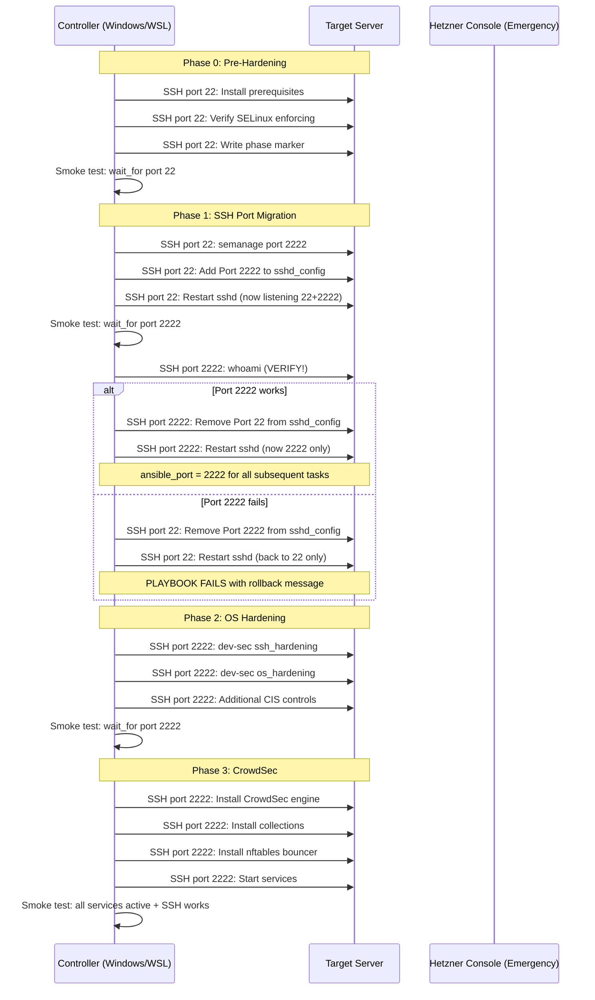

# Ansible Hardening Playbook Architecture

> **Status**: Draft
> **Author**: Cass Whitfield (stax-architect)
> **Date**: 2026-03-24
> **Target**: AlmaLinux 9.7 on Hetzner Cloud
> **Test Server**: helix-stax-test (178.156.172.47)

---

## 1. Executive Summary

This document specifies the architecture for an Ansible hardening playbook that transforms a stock AlmaLinux 9.7 Hetzner Cloud server into a CIS-compliant, production-ready host. The playbook runs in four distinct phases, each with explicit rollback points and smoke tests to prevent SSH lockout -- the single most dangerous failure mode.

The security model is three layers with no overlap:

| Layer | Tool | Scope |
|-------|------|-------|
| Edge | Cloudflare | WAF, DDoS, tunnel, external traffic filtering |
| Host IDS | CrowdSec | Attack detection, dynamic IP banning via nftables |
| OS hardening | dev-sec/hardening | CIS benchmarks, SSH hardening, sysctl, permissions |

Firewalld is NOT configured beyond ensuring the service is running (AlmaLinux default). Cloudflare is the firewall. CrowdSec uses nftables directly for its bouncer.

---

## 2. Component Architecture

### 2.1 Role Structure

```
ansible/
  inventory/
    hosts.ini                    # Updated with test/prod groups
    group_vars/
      all.yml                    # Shared variables (SSH port, users)
      test.yml                   # Test server overrides
      prod.yml                   # Production overrides
    host_vars/
      helix-stax-test.yml        # Per-host (test)
      helix-stax-cp.yml          # Per-host (prod CP)
  playbooks/
    harden.yml                   # Master hardening playbook
    backup_to_hetzner.yml        # (existing)
    emergency_fetch.yml          # (existing)
  roles/
    pre_hardening/               # Phase 0: prerequisites + snapshot
      tasks/main.yml
      defaults/main.yml
      handlers/main.yml
    ssh_port_migration/          # Phase 1: the dangerous part
      tasks/main.yml
      tasks/rollback.yml
      defaults/main.yml
      handlers/main.yml
    os_hardening/                # Phase 2: CIS + dev-sec
      tasks/main.yml
      defaults/main.yml
      handlers/main.yml
    crowdsec/                    # Phase 3: IDS layer
      tasks/main.yml
      tasks/install_engine.yml
      tasks/install_bouncer.yml
      tasks/configure.yml
      defaults/main.yml
      handlers/main.yml
      templates/
        acquis.yaml.j2
        crowdsec-config.yaml.j2
    smoke_test/                  # Reusable connectivity check
      tasks/main.yml
      defaults/main.yml
    backup_hetzner/              # (existing)
    emergency_keys/              # (existing)
  requirements.yml               # Galaxy collection dependencies
  ansible.cfg                    # (existing, updated)
```

### 2.2 Galaxy Dependencies (requirements.yml)

```yaml
collections:
  - name: devsec.hardening
    version: ">=10.0.0"         # SSH + OS hardening roles
  - name: community.general
    version: ">=9.0.0"          # SELinux modules, etc.
```

No other external collections required. CrowdSec has no official Ansible collection -- we write a custom role.

---

## 3. Execution Phases

The master playbook `harden.yml` executes four phases in strict order. Each phase ends with a smoke test. If the smoke test fails, the playbook stops (no auto-rollback -- manual intervention required with documented recovery steps).

```
Phase 0: Pre-Hardening (prerequisites, snapshot)
    |
    v
  [SMOKE TEST: SSH on port 22 works]
    |
Phase 1: SSH Port Migration (22 -> 2222, SELinux, dual-listen)
    |
    v
  [SMOKE TEST: SSH on port 2222 works]
    |
Phase 2: OS Hardening (dev-sec CIS, sysctl, permissions)
    |
    v
  [SMOKE TEST: SSH on port 2222 still works, services running]
    |
Phase 3: CrowdSec (engine + bouncer + collections)
    |
    v
  [SMOKE TEST: CrowdSec running, SSH still works, bouncer active]
    |
  DONE
```

### 3.1 Phase 0: Pre-Hardening

**Role**: `pre_hardening`
**Purpose**: Prepare the server and create a safety net before any changes.
**Risk level**: Low (no destructive changes).

**Tasks (in order)**:

1. **Validate connectivity**: Confirm SSH on current port works.
2. **Gather facts**: `ansible.builtin.setup` (needed for OS detection, IP addresses).
3. **Install prerequisites**: `dnf install -y policycoreutils-python-utils setools-console` (provides `semanage`, needed for SSH port labeling).
4. **Verify SELinux is enforcing**: `getenforce` check. Fail if not enforcing (never disable SELinux).
5. **Install dnf packages**: `dnf-automatic`, `chrony`, `aide`, `rsync`.
6. **Enable chrony**: Time sync is prerequisite for CrowdSec and log correlation.
7. **Create pre-hardening snapshot tag**: Write `/etc/helix-stax/hardening-phase` file with timestamp and phase marker. This is an audit trail, not a VM snapshot (Hetzner API snapshots are separate and done manually before running the playbook).

**Variables (defaults/main.yml)**:
```yaml
pre_hardening_packages:
  - policycoreutils-python-utils
  - setools-console
  - dnf-automatic
  - chrony
  - aide
  - rsync
```

**Smoke test**: Confirm SSH connectivity on current port. Confirm SELinux is enforcing.

### 3.2 Phase 1: SSH Port Migration (CRITICAL PATH)

**Role**: `ssh_port_migration`
**Purpose**: Change SSH from port 22 to port 2222 without losing access.
**Risk level**: HIGH. This is where lockout happens.

#### Lockout Prevention Strategy

The strategy is: **never remove port 22 until port 2222 is proven to work through an actual SSH connection test from the Ansible controller.**

**Step-by-step execution**:

```
Step 1.1: Label port 2222 for SSH in SELinux
          semanage port -a -t ssh_port_t -p tcp 2222
          (Idempotent: -m flag if already exists)
              |
Step 1.2: Configure sshd to listen on BOTH 22 AND 2222
          Add "Port 2222" line to sshd_config
          Keep "Port 22" line present
          Restart sshd
              |
Step 1.3: VERIFY port 2222 works
          Use ansible.builtin.wait_for:
            host: {{ inventory_hostname }}
            port: 2222
            timeout: 30
          AND run a command over port 2222:
            ansible.builtin.command: whoami
            vars:
              ansible_port: 2222
              |
         /        \
     SUCCESS     FAILURE
        |           |
Step 1.4:      Step 1.F (ROLLBACK):
Remove port 22   Remove "Port 2222" from sshd_config
from sshd_config  Restart sshd (back to port 22 only)
Restart sshd      Fail the playbook with clear message:
        |          "Port 2222 verification failed. Rolled
Step 1.5:          back to port 22. Check firewall/SELinux."
Set ansible_port
to 2222 for all
subsequent tasks
```

**Key design decisions for lockout prevention**:

1. **Dual-listen window**: sshd listens on BOTH ports simultaneously. The Ansible control connection stays alive on port 22 throughout.
2. **Active verification**: We do not trust `ss -tlnp` alone. We attempt an actual SSH connection on port 2222 from the controller.
3. **Automatic rollback on failure**: If the port 2222 test fails, the role removes the port 2222 config and restarts sshd, leaving port 22 as the only listener. The playbook then fails with a clear error.
4. **Never remove port 22 first**: Port 22 is only removed from sshd_config AFTER successful verification of port 2222.
5. **Handler ordering**: sshd restart uses `listen: restart sshd` handler, but we use explicit `ansible.builtin.service` tasks (not handlers) for the migration steps because handler execution order is less predictable.

**Variables (defaults/main.yml)**:
```yaml
ssh_port_new: 2222
ssh_port_old: 22
ssh_allowed_users:
  - wakeem
ssh_permit_root_login: "no"
ssh_password_authentication: "no"
ssh_pubkey_authentication: "yes"
ssh_max_auth_tries: 3
ssh_port_verify_timeout: 30   # seconds to wait for port 2222
```

**What happens if the playbook fails mid-run in this phase?**

| Failure Point | Server State | Recovery |
|---------------|-------------|----------|
| Before step 1.2 | Port 22 only, SELinux port labeled | Safe. Re-run playbook. |
| During step 1.2 (sshd restart fails) | sshd may be down | SSH via Hetzner console. Fix sshd_config. `systemctl start sshd`. |
| After step 1.2, before 1.4 | Both ports listening | Safe. Re-run playbook. Port 22 still works. |
| Step 1.3 fails (verification) | Rollback triggered -> port 22 only | Safe. Investigate why 2222 failed. Re-run. |
| After step 1.4 | Port 2222 only | Connect via port 2222. If fails: Hetzner console. |

**Hetzner Console as last resort**: Hetzner Cloud provides a web console (VNC) that bypasses SSH entirely. This is the emergency escape hatch. Document the URL pattern: `https://console.hetzner.cloud/projects/{id}/servers/{server-id}/console`.

**Smoke test**: SSH connection on port 2222 succeeds. SSH connection on port 22 is refused (confirming old port is closed).

### 3.3 Phase 2: OS Hardening

**Role**: `os_hardening`
**Purpose**: Apply CIS Level 1 hardening via dev-sec collection.
**Risk level**: Medium. Some sysctl/permission changes can break services if misconfigured.

This role is a thin wrapper around `devsec.hardening.os_hardening` and `devsec.hardening.ssh_hardening` with our overrides.

**Execution order within this phase**:

1. **Apply `devsec.hardening.ssh_hardening`** with our overrides (port, users, auth methods).
2. **Apply `devsec.hardening.os_hardening`** with our overrides.
3. **Apply additional CIS controls** not covered by dev-sec (file permissions, audit rules).

**dev-sec SSH hardening overrides**:
```yaml
# These variables override dev-sec defaults
ssh_server_ports:
  - "{{ ssh_port_new }}"          # 2222 (port 22 already removed in Phase 1)
ssh_allow_users: "{{ ssh_allowed_users }}"   # wakeem
ssh_permit_root_login: "no"
ssh_password_authentication: false
ssh_pubkey_authentication: true
ssh_max_auth_tries: "{{ ssh_max_auth_tries }}"
ssh_print_motd: true
ssh_print_last_log: true
ssh_client_alive_interval: 300
ssh_client_alive_count_max: 3
ssh_challengeresponse_authentication: false
ssh_permit_empty_passwords: false
ssh_max_sessions: 5
ssh_use_dns: false
# CRITICAL: Do not let dev-sec restart sshd during its run
# We already configured sshd in Phase 1. dev-sec should only
# validate/reinforce, not restart.
ssh_hardening_enabled: true
```

**dev-sec OS hardening overrides**:
```yaml
os_auth_pw_max_age: 90
os_auth_pw_min_age: 7
os_auth_retries: 3
os_security_users_allow: "{{ ssh_allowed_users }}"
os_security_kernel_enable_module_loading: true   # K3s needs this
os_security_kernel_enable_core_dump: false
os_security_suid_sgid_enforce: true
os_security_suid_sgid_remove_from_unknown: false  # Conservative: don't break packages
sysctl_overwrite:
  net.ipv4.ip_forward: 1                          # Required for K3s pod networking
  net.bridge.bridge-nf-call-iptables: 1            # Required for K3s
  net.bridge.bridge-nf-call-ip6tables: 1           # Required for K3s
  net.ipv4.conf.all.forwarding: 1                  # Required for K3s
  net.ipv6.conf.all.forwarding: 1                  # Required for K3s
```

**K3s compatibility notes** (these are NOT applied now, but the sysctl values above must be set NOW to avoid re-hardening later):

- `net.ipv4.ip_forward=1` -- K3s requires IP forwarding for pod-to-pod traffic.
- `bridge-nf-call-iptables=1` -- K3s Flannel CNI requires this for service routing.
- `os_security_kernel_enable_module_loading: true` -- K3s loads kernel modules at runtime.
- SELinux boolean `container_manage_cgroup` will be set during K3s installation, NOT during hardening. The hardening playbook only ensures SELinux is enforcing.

**Additional CIS controls (not covered by dev-sec)**:

| CIS Control | Action |
|-------------|--------|
| 1.1.1.x | Disable unused filesystems (cramfs, freevxfs, jffs2, hfs, hfsplus, udf) |
| 1.4.1 | Ensure GRUB bootloader password is set (skip on cloud -- no physical access) |
| 3.4.x | Ensure firewalld service is running (default state, no rules added) |
| 4.1.x | Ensure auditd is installed and running |
| 4.2.x | Configure rsyslog |
| 5.2.x | SSH hardening (covered by dev-sec + Phase 1) |
| 5.3.x | PAM configuration (password quality via pwquality) |
| 5.4.x | User account settings (password aging, login.defs) |

**Smoke test**: SSH on port 2222. `getenforce` returns Enforcing. `sysctl net.ipv4.ip_forward` returns 1.

### 3.4 Phase 3: CrowdSec

**Role**: `crowdsec`
**Purpose**: Install and configure CrowdSec Security Engine + firewall bouncer.
**Risk level**: Medium-low. CrowdSec listens passively; the bouncer is additive.

**Sub-tasks**:

#### 3.4.1 Install CrowdSec Engine

1. Add CrowdSec RPM repository (`rpm --import` key + repo file).
2. `dnf install crowdsec` (Security Engine -- the agent that parses logs).
3. Install CrowdSec collections:
   - `cscli collections install crowdsecurity/linux` -- system-level detection (SSH, sudo abuse, etc.)
   - `cscli collections install crowdsecurity/sshd` -- SSH brute force detection
4. Configure acquisition (`/etc/crowdsec/acquis.yaml`):
   ```yaml
   filenames:
     - /var/log/secure
     - /var/log/messages
   labels:
     type: syslog
   ---
   source: journalctl
   journalctl_filter:
     - "_SYSTEMD_UNIT=sshd.service"
   labels:
     type: syslog
   ```
5. Start and enable `crowdsec.service`.

#### 3.4.2 Install CrowdSec Firewall Bouncer

1. `dnf install crowdsec-firewall-bouncer-nftables` (uses nftables, NOT firewalld).
2. The bouncer auto-generates an API key during install and registers with the local LAPI.
3. If API key generation fails (race condition with engine startup), manually register:
   ```
   cscli bouncers add firewall-bouncer
   ```
   Then write the key to `/etc/crowdsec/bouncers/crowdsec-firewall-bouncer.yaml`.
4. Start and enable `crowdsec-firewall-bouncer.service`.

#### 3.4.3 Configure LAPI

The Local API (LAPI) runs on port 8080 (localhost only by default). No configuration changes needed for single-server deployment.

For future multi-node: LAPI will move to the control plane, and workers will connect as agents. This is NOT implemented now.

#### 3.4.4 Console Registration (Optional, Deferred)

CrowdSec Console provides a web dashboard at app.crowdsec.net. Registration:
```
cscli console enroll <enrollment_key>
```
This is deferred -- can be done manually post-hardening. The `enrollment_key` would come from the CrowdSec Console web UI.

**CrowdSec + No Firewalld -- How It Works**:

CrowdSec's `crowdsec-firewall-bouncer-nftables` creates its own nftables set and chain. It does NOT interact with firewalld at all. The bouncer directly manipulates nftables rules to block banned IPs.

```
Packet arrives -> nftables (CrowdSec bouncer chain checks ban list)
                     |
                  Not banned -> normal processing (firewalld's default accept)
                  Banned -> DROP
```

Firewalld continues to run in its default state (all ports open, which is fine because Cloudflare + Hetzner firewall handle external filtering). CrowdSec adds a surgical nftables layer on top.

**Variables (defaults/main.yml)**:
```yaml
crowdsec_repo_url: "https://packagecloud.io/install/repositories/crowdsec/crowdsec/script.rpm.sh"
crowdsec_collections:
  - crowdsecurity/linux
  - crowdsecurity/sshd
crowdsec_bouncer_type: nftables     # NOT iptables, NOT firewalld
crowdsec_lapi_listen: "127.0.0.1:8080"
crowdsec_console_enroll: false       # Deferred
crowdsec_console_key: ""             # Set when enrolling
```

**Smoke test**: `systemctl is-active crowdsec` returns active. `systemctl is-active crowdsec-firewall-bouncer` returns active. `cscli metrics` returns data. SSH on port 2222 still works (bouncer is not blocking us).

---

## 4. Lockout Prevention Strategy (Consolidated)

This section consolidates all lockout prevention measures across all phases.

### 4.1 Pre-Flight Checks (Before Running Playbook)

1. **Create Hetzner snapshot**: Via API or UI. This is the nuclear rollback option.
2. **Verify Hetzner console access**: Log into console.hetzner.cloud and confirm you can reach the VNC console for the target server.
3. **Test SSH key**: `ssh -i ~/.ssh/id_rsa wakeem@178.156.172.47` works.
4. **Keep a second terminal open**: Maintain an active SSH session in a separate terminal throughout the entire playbook run. Existing SSH sessions survive sshd restarts.

### 4.2 During Execution

| Safeguard | Phase | Mechanism |
|-----------|-------|-----------|
| Dual-port listening | 1 | sshd listens on 22+2222 simultaneously |
| Active port verification | 1 | Actual SSH command run over port 2222 before removing 22 |
| Automatic rollback | 1 | Port 2222 failure triggers removal of 2222 config, revert to 22 |
| Existing session preservation | 1 | `sshd -t` config test before restart; restart (not stop+start) preserves connections |
| SELinux labeling first | 1 | Port labeled BEFORE sshd config change |
| ClientAliveInterval | 2 | dev-sec sets keepalive so control connection does not drop |
| No firewall rules | All | firewalld stays default-open; only CrowdSec bouncer adds targeted blocks |
| Phase markers | All | `/etc/helix-stax/hardening-phase` tracks progress for manual recovery |

### 4.3 Emergency Recovery (If Locked Out)

| Scenario | Recovery |
|----------|----------|
| SSH port 2222 not reachable, port 22 also closed | Hetzner VNC console -> `vi /etc/ssh/sshd_config` -> restore Port 22 -> `systemctl restart sshd` |
| sshd won't start (config error) | Hetzner VNC console -> `sshd -t` to find error -> fix config -> start sshd |
| CrowdSec banned your IP | `cscli decisions delete --ip YOUR_IP` via Hetzner console, or wait for ban expiry |
| SELinux blocking port 2222 | Hetzner console -> `semanage port -a -t ssh_port_t -p tcp 2222` -> restart sshd |
| Hetzner snapshot restore | Hetzner UI -> Snapshots -> Restore (wipes all changes, back to pre-hardening state) |

---

## 5. Inventory Design

### 5.1 Updated hosts.ini

```ini
[all:vars]
ansible_user=wakeem
ansible_ssh_private_key_file=~/.ssh/id_rsa
ansible_ssh_common_args='-o StrictHostKeyChecking=no'

[test]
helix-stax-test ansible_host=178.156.172.47 ansible_port=22

[prod_cp]
helix-stax-cp ansible_host=178.156.233.12 ansible_port=22

[prod_workers]
# helix-worker-1 ansible_host=<TBD> ansible_port=22

[prod:children]
prod_cp
prod_workers

[k3s_servers:children]
prod_cp

[k3s_agents:children]
prod_workers
```

**Note on ansible_user**: The existing inventory uses `deployer`. The task spec says the test server has `wakeem`. The new inventory uses `wakeem` consistently. If prod servers use a different user, override in `host_vars/`.

**Note on ansible_port**: Starts at 22. After Phase 1 completes successfully, the inventory must be updated to `ansible_port=2222` for subsequent playbook runs. The hardening playbook handles this internally via `set_fact` during execution. For subsequent standalone playbook runs, update the inventory.

### 5.2 Group Variables

**group_vars/all.yml** (shared across all servers):
```yaml
# SSH Configuration
ssh_port_new: 2222
ssh_port_old: 22
ssh_allowed_users:
  - wakeem

# Hardening
selinux_state: enforcing

# CrowdSec
crowdsec_collections:
  - crowdsecurity/linux
  - crowdsecurity/sshd

# K3s readiness (sysctl values needed BEFORE k3s install)
k3s_sysctl_required:
  net.ipv4.ip_forward: 1
  net.bridge.bridge-nf-call-iptables: 1
  net.bridge.bridge-nf-call-ip6tables: 1
  net.ipv4.conf.all.forwarding: 1
  net.ipv6.conf.all.forwarding: 1
```

**group_vars/test.yml** (test-only overrides):
```yaml
# Test server specific
hardening_dry_run: false     # Set to true for check mode
crowdsec_console_enroll: false
```

**group_vars/prod.yml** (production overrides):
```yaml
crowdsec_console_enroll: false   # Enable when ready
```

---

## 6. Master Playbook Design

### 6.1 harden.yml

```yaml
---
- name: Harden AlmaLinux 9 Server
  hosts: "{{ target_hosts | default('test') }}"
  become: true
  gather_facts: true

  pre_tasks:
    - name: Display target information
      ansible.builtin.debug:
        msg: "Hardening {{ inventory_hostname }} ({{ ansible_host }})"

  roles:
    - role: pre_hardening
      tags: [phase0, prerequisites]

    - role: smoke_test
      vars:
        smoke_test_port: "{{ ssh_port_old }}"
        smoke_test_label: "Phase 0 complete"
      tags: [phase0, smoke]

    - role: ssh_port_migration
      tags: [phase1, ssh]

    - role: smoke_test
      vars:
        smoke_test_port: "{{ ssh_port_new }}"
        smoke_test_label: "Phase 1 complete"
      tags: [phase1, smoke]

    - role: os_hardening
      tags: [phase2, cis]

    - role: smoke_test
      vars:
        smoke_test_port: "{{ ssh_port_new }}"
        smoke_test_label: "Phase 2 complete"
      tags: [phase2, smoke]

    - role: crowdsec
      tags: [phase3, ids]

    - role: smoke_test
      vars:
        smoke_test_port: "{{ ssh_port_new }}"
        smoke_test_label: "Phase 3 complete (HARDENING DONE)"
      tags: [phase3, smoke]

  post_tasks:
    - name: Write completion marker
      ansible.builtin.copy:
        content: |
          hardening_completed: {{ ansible_date_time.iso8601 }}
          ssh_port: {{ ssh_port_new }}
          selinux: enforcing
          crowdsec: active
        dest: /etc/helix-stax/hardening-complete
        mode: '0644'
```

### 6.2 Tag-Based Execution

Tags allow running individual phases or skipping completed ones:

```bash
# Full run (all phases)
ansible-playbook playbooks/harden.yml -e target_hosts=test

# Only Phase 1 (SSH migration) -- useful for retry after failure
ansible-playbook playbooks/harden.yml -e target_hosts=test --tags phase1

# Skip CrowdSec (phases 0-2 only)
ansible-playbook playbooks/harden.yml -e target_hosts=test --skip-tags phase3

# Dry run (check mode)
ansible-playbook playbooks/harden.yml -e target_hosts=test --check
```

---

## 7. Smoke Test Role Design

**Role**: `smoke_test`
**Purpose**: Reusable connectivity and health verification after each phase.

**Tasks**:

1. **Wait for SSH port**: `wait_for` on the target port from the controller.
2. **Run whoami over SSH**: Actual command execution to verify auth works.
3. **Check SELinux status**: `getenforce` returns Enforcing.
4. **Log phase marker**: Write phase completion to `/etc/helix-stax/hardening-phase`.

**Variables**:
```yaml
smoke_test_port: 22           # Override per phase
smoke_test_label: "unknown"   # Human-readable phase label
smoke_test_timeout: 30        # Seconds to wait for port
```

The smoke test role uses `delegate_to: localhost` for the `wait_for` check (testing from the controller), then runs the remaining checks on the target host.

---

## 8. Variable Design

### 8.1 What Is Configurable

| Variable | Default | Where Set | Why Configurable |
|----------|---------|-----------|-----------------|
| `ssh_port_new` | 2222 | group_vars/all.yml | Different environments may use different ports |
| `ssh_port_old` | 22 | group_vars/all.yml | Starting state may vary |
| `ssh_allowed_users` | [wakeem] | group_vars/all.yml | User list varies per environment |
| `ssh_max_auth_tries` | 3 | group_vars/all.yml | Tunable security parameter |
| `crowdsec_collections` | [linux, sshd] | group_vars/all.yml | May add more collections later |
| `crowdsec_console_enroll` | false | group_vars/{env}.yml | Per-environment decision |
| `pre_hardening_packages` | [list] | role defaults | Extend with additional packages |
| `target_hosts` | test | CLI `-e` flag | Never hardcode target |

### 8.2 What Is Hardcoded

| Setting | Value | Why Hardcoded |
|---------|-------|---------------|
| SELinux mode | enforcing | Non-negotiable security requirement |
| SSH root login | no | Non-negotiable |
| SSH password auth | no | Non-negotiable (key-only) |
| SSH pubkey auth | yes | Required for access |
| CrowdSec bouncer type | nftables | Architectural decision (no firewalld rules) |
| IP forwarding | 1 | K3s requirement, always needed |
| firewalld config | none (default) | Architectural decision (Cloudflare is firewall) |

---

## 9. SELinux Design

### 9.1 During Hardening

| SELinux Action | When | Command |
|----------------|------|---------|
| Label port 2222 for SSH | Phase 1, step 1.1 | `semanage port -a -t ssh_port_t -p tcp 2222` |
| Verify enforcing | Phase 0, Phase 2 | `getenforce` check |

### 9.2 K3s Booleans (NOT Applied During Hardening)

These are documented here for reference. They will be applied during the K3s installation playbook (separate from hardening):

```bash
setsebool -P container_manage_cgroup on
# Additional booleans TBD during K3s install phase
```

**Why deferred**: K3s-specific SELinux booleans should be set as part of the K3s installation role, not the base hardening. The hardening playbook ensures SELinux is enforcing and properly configured; the K3s playbook adds the specific exemptions K3s needs.

---

## 10. Data Flow

### 10.1 Playbook Execution Flow



---

## 11. Security Architecture

### 11.1 Three-Layer Model (No Overlap)

```
Internet Traffic
      |
[Layer 1: Cloudflare]
  - WAF rules
  - DDoS protection
  - Bot management
  - Cloudflare Tunnel (future)
  - Only proxied traffic reaches server
      |
[Layer 2: CrowdSec (Host IDS)]
  - Parses /var/log/secure, journald
  - Detects brute force, CVE exploits
  - Bouncer adds nftables DROP rules for banned IPs
  - Community blocklists (optional)
      |
[Layer 3: OS Hardening (dev-sec)]
  - CIS Level 1 benchmark
  - Minimal attack surface
  - SSH hardened (port, key-only, user whitelist)
  - SELinux enforcing
  - Disabled unused kernel modules
  - Restricted file permissions
  - Sysctl hardened (except K3s-required forwarding)
      |
[Server Application Layer]
  - K3s (future)
  - Pod networking via Flannel
```

### 11.2 Trust Boundaries

| Boundary | Protection |
|----------|-----------|
| Internet -> Server | Cloudflare (WAF + tunnel) |
| Server -> SSH | Key-only, port 2222, user whitelist, CrowdSec monitoring |
| Server -> K8s API | Port 6443, TLS, token auth (K3s phase) |
| Server -> CrowdSec LAPI | localhost only (127.0.0.1:8080) |

### 11.3 Credential Handling

| Secret | Storage | Access Method |
|--------|---------|---------------|
| SSH private key | Local workstation (~/.ssh/id_rsa) | ansible_ssh_private_key_file |
| Hetzner API token | Environment variable | Not used by Ansible (OpenTofu only) |
| CrowdSec bouncer key | Auto-generated on install | /etc/crowdsec/bouncers/*.yaml |
| CrowdSec console key | Manual (deferred) | cscli console enroll |

No secrets in the Ansible repo. SSH key path is a reference, not the key itself.

---

## 12. Implementation Roadmap

### 12.1 File-Level Task Breakdown

| # | File | Description | Depends On | Complexity |
|---|------|-------------|------------|------------|
| 1 | `ansible/requirements.yml` | Galaxy collection dependencies | None | Low |
| 2 | `ansible/inventory/hosts.ini` | Updated inventory with test/prod groups | None | Low |
| 3 | `ansible/inventory/group_vars/all.yml` | Shared variables | None | Low |
| 4 | `ansible/inventory/group_vars/test.yml` | Test overrides | #3 | Low |
| 5 | `ansible/inventory/group_vars/prod.yml` | Prod overrides | #3 | Low |
| 6 | `ansible/roles/smoke_test/tasks/main.yml` | Reusable smoke test role | None | Low |
| 7 | `ansible/roles/smoke_test/defaults/main.yml` | Smoke test defaults | None | Low |
| 8 | `ansible/roles/pre_hardening/tasks/main.yml` | Phase 0 tasks | None | Low |
| 9 | `ansible/roles/pre_hardening/defaults/main.yml` | Phase 0 defaults | None | Low |
| 10 | `ansible/roles/ssh_port_migration/tasks/main.yml` | Phase 1 tasks (THE critical file) | #6 | HIGH |
| 11 | `ansible/roles/ssh_port_migration/tasks/rollback.yml` | Phase 1 rollback tasks | #10 | Medium |
| 12 | `ansible/roles/ssh_port_migration/defaults/main.yml` | Phase 1 defaults | None | Low |
| 13 | `ansible/roles/ssh_port_migration/handlers/main.yml` | sshd restart handler | None | Low |
| 14 | `ansible/roles/os_hardening/tasks/main.yml` | Phase 2 dev-sec wrapper | #10 | Medium |
| 15 | `ansible/roles/os_hardening/defaults/main.yml` | Phase 2 defaults (dev-sec overrides) | None | Medium |
| 16 | `ansible/roles/os_hardening/handlers/main.yml` | Phase 2 handlers | None | Low |
| 17 | `ansible/roles/crowdsec/tasks/main.yml` | Phase 3 orchestrator (includes sub-tasks) | None | Low |
| 18 | `ansible/roles/crowdsec/tasks/install_engine.yml` | CrowdSec engine install | None | Medium |
| 19 | `ansible/roles/crowdsec/tasks/install_bouncer.yml` | Bouncer install + registration | #18 | Medium |
| 20 | `ansible/roles/crowdsec/tasks/configure.yml` | Acquisition config, collections | #18 | Medium |
| 21 | `ansible/roles/crowdsec/defaults/main.yml` | CrowdSec defaults | None | Low |
| 22 | `ansible/roles/crowdsec/handlers/main.yml` | CrowdSec service handlers | None | Low |
| 23 | `ansible/roles/crowdsec/templates/acquis.yaml.j2` | Acquisition template | None | Low |
| 24 | `ansible/playbooks/harden.yml` | Master playbook | All roles | Medium |

### 12.2 Implementation Order

**Wave 1 (parallel, no dependencies)**:
- Tasks 1-5 (inventory + requirements)
- Tasks 6-7 (smoke_test role)
- Tasks 8-9 (pre_hardening role)
- Tasks 12-13 (ssh_port_migration defaults + handlers)
- Tasks 21-23 (crowdsec defaults + handlers + templates)

**Wave 2 (depends on Wave 1)**:
- Task 10 (ssh_port_migration/tasks/main.yml) -- HIGH priority, needs careful implementation
- Task 11 (rollback.yml) -- companion to #10

**Wave 3 (depends on Wave 2)**:
- Tasks 14-16 (os_hardening role) -- needs SSH port to be decided
- Tasks 17-20 (crowdsec role tasks)

**Wave 4 (depends on all roles)**:
- Task 24 (master playbook)

### 12.3 Estimated Effort

| Wave | Tasks | Estimated Time |
|------|-------|---------------|
| Wave 1 | 13 files (boilerplate) | ~1 hour |
| Wave 2 | 2 files (critical path) | ~1 hour |
| Wave 3 | 7 files (main logic) | ~1.5 hours |
| Wave 4 | 1 file (integration) | ~30 min |
| **Total** | **24 files** | **~4 hours** |

---

## 13. Architecture Decision Records

### ADR-HARDEN-001: No Firewalld Rules

**Decision**: Do not add any firewalld rules. Leave firewalld in its default running state.

**Rationale**: Cloudflare handles all external traffic filtering. Adding firewalld rules creates a second layer of port management that conflicts with CrowdSec's nftables bouncer and complicates debugging. The three-layer model (Cloudflare / CrowdSec / OS hardening) is cleaner when each layer has a single responsibility.

**Alternatives considered**:
- Add firewalld rules to restrict ports: Rejected because it duplicates Cloudflare's job and can block CrowdSec bouncer traffic or K3s pod networking.
- Disable firewalld entirely: Rejected because CIS benchmarks expect a firewall service running, and some security scanners flag it.

**Consequences**: Ports are "open" at the OS level. This is acceptable because Cloudflare + Hetzner Cloud firewall filter traffic before it reaches the server. CrowdSec provides dynamic IP banning for anything that gets through.

### ADR-HARDEN-002: Dual-Listen SSH Port Migration

**Decision**: During SSH port change, listen on BOTH old and new ports simultaneously. Only remove the old port after actively verifying the new port works via an actual SSH connection test.

**Rationale**: This is the only safe way to change SSH ports remotely. Any other approach (stop-change-start, or atomic switchover) risks lockout if the new port fails for any reason (SELinux, typo, network issue).

**Alternatives considered**:
- Atomic port switchover: Rejected -- if new port fails, you are locked out.
- Use Hetzner console for all SSH changes: Rejected -- VNC console is slow and error-prone. Ansible automation is preferred.
- Use a cron job to revert after N minutes: Considered but rejected in favor of the simpler dual-listen approach, which handles the same risk without timing complexity.

**Consequences**: There is a brief window where both ports are open. This window is seconds long and acceptable. The old port is removed within the same playbook run.

### ADR-HARDEN-003: CrowdSec nftables Bouncer (Not firewalld Bouncer)

**Decision**: Use `crowdsec-firewall-bouncer-nftables` instead of the firewalld bouncer.

**Rationale**: Consistent with ADR-HARDEN-001 (no firewalld rules). The nftables bouncer operates at a lower level, creating its own nftables chain. It does not interact with firewalld at all, avoiding conflicts.

**Alternatives considered**:
- firewalld bouncer: Rejected because we are not managing firewalld rules.
- iptables bouncer: Works but nftables is the modern successor and AlmaLinux 9 uses nftables by default.

**Consequences**: CrowdSec ban decisions appear in `nft list ruleset`, not `firewall-cmd` output. Operators need to know to check nftables directly.

### ADR-HARDEN-004: K3s Sysctl Values Set During Hardening

**Decision**: Set K3s-required sysctl values (`ip_forward`, `bridge-nf-call-iptables`, etc.) during the hardening phase, not during K3s installation.

**Rationale**: If these values are set by the hardening playbook, the K3s installation playbook does not need to modify hardened sysctl settings. This avoids a "harden then un-harden" pattern. The values are safe to enable on a non-K3s server (IP forwarding alone does not create a security risk when there are no routes to forward).

**Alternatives considered**:
- Set during K3s install: Means the K3s role must override hardening settings, creating a dependency and potential drift.
- Set in a shared "base OS" role: Over-engineers it for two values.

**Consequences**: A hardened server without K3s will have IP forwarding enabled. This is a minor deviation from minimal-surface hardening, but acceptable for this use case (all servers will eventually run K3s).

### ADR-HARDEN-005: Custom CrowdSec Role (Not Galaxy)

**Decision**: Write a custom Ansible role for CrowdSec instead of using a community Galaxy role.

**Rationale**: No official CrowdSec Ansible collection exists. Community roles vary in quality and may not support the nftables bouncer or AlmaLinux 9 specifically. The installation is simple enough (repo + dnf + cscli) that a custom role is lower risk than depending on an unmaintained third-party role.

**Alternatives considered**:
- Use `geerlingguy.crowdsec` or similar: No official role exists, community roles may not support our specific bouncer/OS combination.
- Shell script instead of Ansible role: Rejected -- not idempotent, not consistent with our Ansible-first approach.

**Consequences**: We own the maintenance of this role. CrowdSec version updates require manual role updates.

---

## 14. Risk Assessment

| Risk | Likelihood | Impact | Mitigation |
|------|-----------|--------|------------|
| SSH lockout during port change | Medium | Critical | Dual-listen strategy, active verification, automatic rollback, Hetzner console fallback |
| dev-sec breaks K3s networking | Low | High | K3s sysctl overrides set before dev-sec runs; tested on test server first |
| CrowdSec bans operator IP | Low | Medium | Whitelist operator IP in CrowdSec decisions (or add to bouncer config); CrowdSec Console monitoring |
| SELinux blocks port 2222 | Low | High | `semanage` runs BEFORE sshd config change; verified in smoke test |
| CrowdSec bouncer conflicts with K3s pod networking | Low | Medium | Bouncer operates at nftables level, K3s uses iptables/nftables for its own rules; test on test server first |
| Playbook fails mid-Phase 2 (half-hardened state) | Medium | Medium | Phase markers allow re-running from specific phase via tags; sshd already on 2222 so access is maintained |
| dev-sec collection version incompatibility | Low | Low | Pin collection version in requirements.yml; test before production |
| Time sync drift breaks CrowdSec log parsing | Low | Low | chrony installed in Phase 0 before CrowdSec |

---

## 15. Post-Hardening Verification Checklist

After successful playbook completion, manually verify:

```bash
# SSH
ssh -p 2222 wakeem@178.156.172.47 whoami     # Should succeed
ssh -p 22 wakeem@178.156.172.47 whoami        # Should be refused

# SELinux
ssh -p 2222 wakeem@178.156.172.47 'getenforce'              # Enforcing
ssh -p 2222 wakeem@178.156.172.47 'semanage port -l | grep ssh'  # 2222

# CrowdSec
ssh -p 2222 wakeem@178.156.172.47 'sudo cscli metrics'      # Should show data
ssh -p 2222 wakeem@178.156.172.47 'sudo systemctl is-active crowdsec'  # active
ssh -p 2222 wakeem@178.156.172.47 'sudo systemctl is-active crowdsec-firewall-bouncer'  # active

# OS Hardening
ssh -p 2222 wakeem@178.156.172.47 'sudo sysctl net.ipv4.ip_forward'   # = 1
ssh -p 2222 wakeem@178.156.172.47 'cat /etc/helix-stax/hardening-complete'

# firewalld (should be running but with NO custom rules)
ssh -p 2222 wakeem@178.156.172.47 'sudo systemctl is-active firewalld'  # active
```

---

## 16. Future Considerations

### 16.1 Production Deployment

After validating on helix-stax-test:
1. Create Hetzner snapshot of prod server.
2. Update inventory `ansible_port` for prod servers (currently 22).
3. Run: `ansible-playbook playbooks/harden.yml -e target_hosts=prod_cp`
4. Verify via checklist above.
5. Destroy test server to save costs.

### 16.2 K3s Installation (Next Phase)

The hardened server is K3s-ready:
- IP forwarding enabled
- SELinux enforcing (K3s booleans applied during K3s install)
- CrowdSec monitoring SSH and system logs
- Port 6443 accessible (no firewalld blocking)

A separate `k3s_install` role/playbook will handle K3s deployment.

### 16.3 Multi-Node CrowdSec

When adding worker nodes:
- Control plane runs CrowdSec LAPI (central)
- Workers run CrowdSec agent + bouncer, connecting to CP LAPI
- This requires opening LAPI port between nodes (or using a Cloudflare tunnel)

This is deferred until worker node integration.
